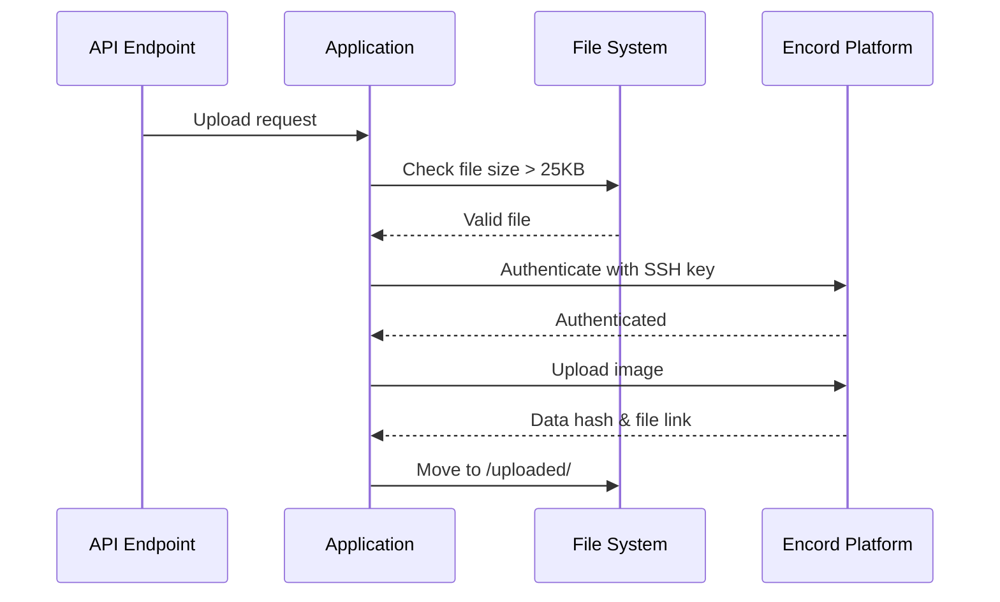

# Functionality Guide

This document describes what the Data Gateway application does and how it works. The application is organized into several functional areas.

## Overview

The Data Gateway is a Flask-based REST API that integrates three external services to collect and manage energy infrastructure data:

```
┌─────────────────────────────────────────────────────────┐
│              Data Gateway Application                    │
│  ┌──────────┐  ┌──────────┐  ┌──────────────────────┐  │
│  │ Sentinel │  │ ENTSOE   │  │  Encord              │  │
│  │ Module   │  │ Module   │  │  Module              │  │
│  └──────────┘  └──────────┘  └──────────────────────┘  │
└─────────────────────────────────────────────────────────┘
       ↓               ↓                    ↓
┌─────────────┐  ┌──────────┐      ┌────────────────┐
│ Sentinel Hub│  │ ENTSOE   │      │ Encord         │
│ (Satellite) │  │ (Energy) │      │ (ML Platform)  │
└─────────────┘  └──────────┘      └────────────────┘
```

---

## Core Functionality

### 1. Satellite Image Management

**Purpose**: Download satellite images of power stations from Sentinel Hub.

**How it works**:

1. **Station Configuration**: Reads power station locations from `stations.csv`
   ```csv
   Name,L1,L2,L3,L4,Collection ID
   Andong power station,128.545,36.599,128.537,36.592,34170c46...
   ```

2. **OAuth Authentication**: Obtains access token from Sentinel Hub
   ```python
   # Token is cached and reused until expiry
   token = get_oauth_token()
   ```

3. **Image Download**: Requests satellite imagery for specific coordinates and dates
   ```python
   # Downloads image for a station on a specific date
   download_image_for_station(station, date)
   ```

4. **File Storage**: Saves images with naming format: `{station-name}-{dd-mm-yyyy}.jpg`

**Key Features**:

- **Batch Downloads**: Download images for all stations between date ranges
- **Parallel Processing**: Uses thread pools for concurrent downloads (7 workers)
- **Duplicate Prevention**: Checks existing images to avoid re-downloading
- **Size Validation**: Verifies images are > 25KB before processing

**File Flow**:
```
Sentinel Hub → Download → /images/ → Validation → Upload → /uploaded/
                                                    ↓
                                               Invalid → /unusable/
```

---

### 2. Energy Data Collection (ENTSOE)

**Purpose**: Fetch European electricity generation data from ENTSOE Transparency Platform.

**What data is collected**:

- **Brown Coal** generation (MW)
- **Gas** generation (MW)
- **Hard Coal** generation (MW)
- **Nuclear** generation (MW)

**Supported Countries**: 33 European countries including AT, BE, DE, ES, FR, IT, etc.

**How it works**:

1. **API Query**: Requests generation data for country and date range
   ```python
   client.query_generation(country_code, start=start_date, end=end_date)
   ```

2. **Data Transformation**: Converts JSON response to CSV format
   ```
   Reading date | Country | Brown Coal | Gas | Hard Coal | Nuclear | Source | Reading Type
   2024-01-01   | AT      | 1234       | 567 | 890       | 456     | entsoe | actual
   ```

3. **File Storage**: Saves as `{COUNTRY_CODE}-entsoe_data.csv`

4. **File Processing**: 
   - Converts raw files to standardized format
   - Aggregates hourly data to daily values
   - Archives processed files

**Data Flow**:
```
ENTSOE API → Raw CSV → /entsoe-download/
                ↓
          Convert & Aggregate
                ↓
          Formatted CSV → /entsoe-revised-output/
                ↓
            Archive → /entsoe-revised-archive/
```

**Time Handling**:
- All timestamps converted to local timezone for each country
- Uses `pytz` for timezone conversions
- Handles special case for Kosovo (XK) → uses Rome timezone

---

### 3. Encord Dataset Management

**Purpose**: Upload satellite images to Encord for machine learning labeling and analysis.

**Encord Concepts**:

- **Dataset**: Storage container for images
- **Project**: Labeling workflow linked to a dataset
- **Data Hash**: Unique identifier for each uploaded image
- **Label**: Annotations/classifications added to images

**How it works**:

#### Image Upload



#### Label Retrieval

1. **Connect to Project**: Using project hash/name
2. **Filter by Date**: Get labels for specific time period
3. **Extract Classifications**: Pull out label data and answers
4. **Export Options**: JSON or CSV format

**Bridge System**:

The application manages three "bridges" (different monitoring periods/regions):

- **Legacy Bridge**: Historical data collection
- **Forward Bridge**: Current operational monitoring  
- **Catchups Bridge**: Filling gaps in data coverage

Each bridge has its own:
- Dataset ID
- Project ID
- Image collection

**Synchronization Process**:

```
1. Load Station List → stations.csv
2. For each station:
   a. Download satellite image → Sentinel Hub
   b. Validate image size → > 25KB
   c. Upload to dataset → Encord
   d. Store metadata → data_hash, file_link
3. Move processed images → /uploaded/
```

---

## Module Breakdown

### modules/api.py

**Main API Router** - Defines all HTTP endpoints

Key endpoints:
- `/api` - Health check
- `/entsoe/*` - Energy data endpoints
- `/encord/*` - Dataset management endpoints
- `/sentinel/*` - Satellite image endpoints

### modules/sentinel.py

**Sentinel Hub Integration** - Handles satellite imagery

Functions:
- `get_oauth_token()` - OAuth2 authentication with token caching
- `download_yesterday_image_for_station()` - Download latest image
- `download_all_sat_images_between_dates()` - Batch download with threading
- `get_stations_list()` - Load from CSV

### modules/entsoe.py

**ENTSOE Integration** - Energy generation data

Functions:
- `get_entsoe_data()` - Fetch data for single country
- `get_entsoe_data_all_countries()` - Fetch for all supported countries
- `transform_to_csv()` - Convert JSON to CSV format
- `convert_files_new_format()` - Process and aggregate data
- `archive_converted_files()` - Move to archive

### modules/encordSync.py

**Encord Integration** - Dataset management

Functions:
- `get_dataset()` - Get dataset object by bridge name
- `upload_image()` - Upload single image
- `upload_all_images()` - Batch upload from directory
- `list_data_rows()` - List images in dataset
- `pull_labels()` - Retrieve label data

### modules/encordClassificationsSync.py

**Label Management** - Fetch and export classifications

Functions:
- `sync_encord_labels()` - Pull all labels from date forward
- `transform_labels()` - Format label data for export

### modules/config.py

**Configuration Management** - Load environment variables

Functions for each config variable:
- `get_sentinel_clientId()`
- `get_entsoe_api_key()`
- `get_dataset_id(bridge)`
- etc.

### modules/stations.py

**Station Data** - Load power station information

Functions:
- `loadStationsFromCsv()` - Parse stations.csv into dictionary list

---

## Data Flow Diagrams

### Complete Synchronization Flow

```
┌─────────────────┐
│ API Request     │
│ /encord/sync... │
└────────┬────────┘
         ↓
┌─────────────────────────────────┐
│ 1. Get OAuth Token              │
│    (Sentinel Hub)                │
└────────┬────────────────────────┘
         ↓
┌─────────────────────────────────┐
│ 2. Load Stations                │
│    (stations.csv)                │
└────────┬────────────────────────┘
         ↓
┌─────────────────────────────────┐
│ 3. For Each Station:            │
│    - Download Satellite Image   │
│    - Save to /images/           │
└────────┬────────────────────────┘
         ↓
┌─────────────────────────────────┐
│ 4. Validate Image               │
│    - Check file size > 25KB     │
└────────┬────────────────────────┘
         ↓
┌─────────────────────────────────┐
│ 5. Authenticate with Encord     │
│    (SSH Private Key)             │
└────────┬────────────────────────┘
         ↓
┌─────────────────────────────────┐
│ 6. Upload to Dataset            │
│    - Get data_hash              │
│    - Get file_link              │
└────────┬────────────────────────┘
         ↓
┌─────────────────────────────────┐
│ 7. Move to /uploaded/           │
│    (or /unusable/ if invalid)   │
└────────┬────────────────────────┘
         ↓
┌─────────────────┐
│ Return Response │
└─────────────────┘
```

---

## Error Handling

### Image Validation

```python
if file_size < 25000:
    # Image too small - corrupted or incomplete
    move_to_unusable_folder()
    return None
```

### API Authentication

```python
if token_expired():
    # Request new OAuth token
    token = fetch_new_token()
```

### Missing Configuration

```python
if config_value is None:
    print(f"Warning: {config_name} not configured")
    return default_value
```

---

## Performance Optimizations

### 1. Token Caching

OAuth tokens are cached in memory and reused until expiry:
```python
token = [None]  # Global cache

if token[0] is not None and not expired:
    return cached_token
```

### 2. Parallel Downloads

Uses ThreadPoolExecutor for concurrent image downloads:
```python
with ThreadPoolExecutor(max_workers=7) as executor:
    future_tasks = {
        executor.submit(download_for_date, date): date 
        for date in date_range
    }
```

### 3. Duplicate Detection

Checks existing images before downloading:
```python
if image_exists_in_encord(filename):
    skip_download()
```

---

## Use Cases

### Use Case 1: Daily Monitoring

**Scenario**: Download yesterday's satellite images for all power stations

**Endpoint**: `GET /sentinel/stations_images`

**Process**:
1. Load all stations from CSV
2. Calculate yesterday's date
3. Download image for each station
4. Return list of downloaded filenames

### Use Case 2: Historical Backfill

**Scenario**: Download images for a date range to fill gaps

**Endpoint**: `POST /sentinel/download_all_station_images?start_date=2024-01-01&end_date=2024-01-31`

**Process**:
1. Run in background thread
2. Iterate through each date
3. Download for all stations in parallel
4. Skip existing images
5. Save results to JSON file

### Use Case 3: Energy Data Export

**Scenario**: Get weekly energy generation data for Austria

**Endpoint**: `GET /entsoe?country_code=AT&start=20240101&end=20240107`

**Process**:
1. Query ENTSOE API
2. Transform to CSV format
3. Save to download directory
4. Return file path

### Use Case 4: Label Export

**Scenario**: Export all classifications from Encord for reporting

**Endpoint**: `GET /encord/labels/all?bridge=forward&from_date=2024-01-01&format=simple&media_type=csv`

**Process**:
1. Connect to Encord project
2. Retrieve all labels from date forward
3. Transform to simple format
4. Export as CSV
5. Return file path

---

## Next Steps

- See [APIS.md](./APIS.md) for detailed API endpoint documentation
- Read [INTEGRATION.md](./INTEGRATION.md) to understand external service integrations
- Check [MAINTENANCE.md](./MAINTENANCE.md) for development and testing
