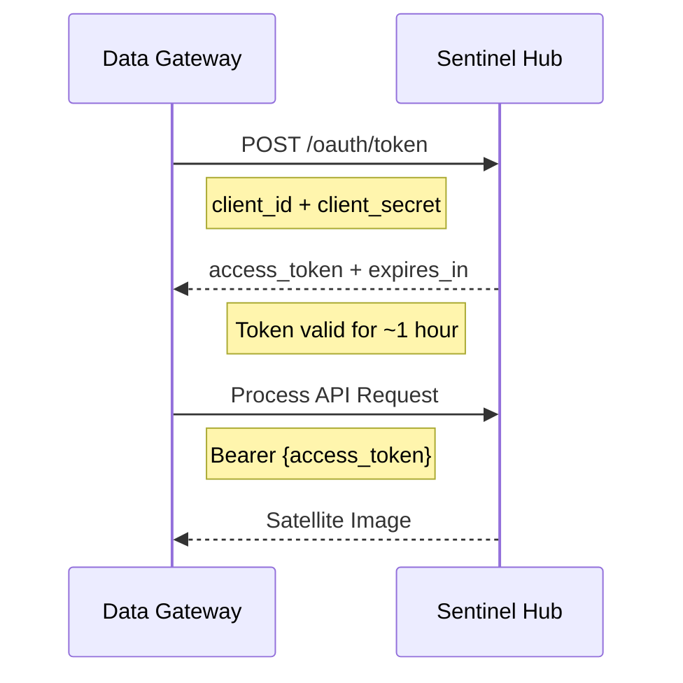

# Integration Guide

This document describes the external services and dependencies that the Data Gateway application integrates with.

## Overview

The Data Gateway integrates with three main external services:

```
                    ┌──────────────────────┐
                    │  Data Gateway App    │
                    └──────────┬───────────┘
                               │
        ┌──────────────────────┼──────────────────────┐
        │                      │                      │
        ▼                      ▼                      ▼
┌───────────────┐      ┌──────────────┐      ┌──────────────┐
│ Sentinel Hub  │      │   ENTSOE     │      │   Encord     │
│  (Imagery)    │      │  (Energy)    │      │    (ML)      │
└───────────────┘      └──────────────┘      └──────────────┘
```

---

## 1. Sentinel Hub

**Purpose**: Provides satellite imagery of Earth's surface.

**Official Website**: https://www.sentinel-hub.com/

**What we use it for**: Downloading satellite images of power stations to monitor infrastructure changes and activity.

### Overview

Sentinel Hub is a cloud platform that provides access to satellite imagery from multiple sources including:
- Sentinel-2 (European Space Agency)
- Landsat (NASA)
- Planet (commercial high-resolution imagery)

### Authentication

**Method**: OAuth2 Client Credentials Flow



**Implementation**:
```python
from oauthlib.oauth2 import BackendApplicationClient
from requests_oauthlib import OAuth2Session

client = BackendApplicationClient(client_id=CLIENT_ID)
oauth = OAuth2Session(client=client)
token = oauth.fetch_token(
    token_url='https://services.sentinel-hub.com/oauth/token',
    client_secret=CLIENT_SECRET,
    include_client_id=True
)
```

**Token Management**:
- Tokens expire after ~1 hour
- Application caches token in memory
- Automatically refreshes when expired

### API Endpoints Used

#### 1. Process API
**Endpoint**: `https://services.sentinel-hub.com/api/v1/process`

**What it does**: Requests processed satellite imagery for specific coordinates and dates.

**Request Structure**:
```json
{
  "input": {
    "bounds": {
      "properties": {
        "crs": "http://www.opengis.net/def/crs/EPSG/0/4326"
      },
      "bbox": [128.537342, 36.59273, 128.545254, 36.599082]
    },
    "data": [{
      "type": "planet_scope",
      "dataFilter": {
        "timeRange": {
          "from": "2024-01-15T00:00:00Z",
          "to": "2024-01-15T23:59:59Z"
        }
      }
    }]
  },
  "output": {
    "width": 512,
    "height": 512,
    "responses": [{
      "identifier": "default",
      "format": {
        "type": "image/jpeg"
      }
    }]
  }
}
```

**Response**: Binary image data (JPEG)

### Key Concepts

#### Bounding Box (BBox)

Defines the geographic area to capture:
```python
bbox = [
    longitude_min,  # l3 - Western edge
    latitude_min,   # l4 - Southern edge
    longitude_max,  # l1 - Eastern edge
    latitude_max    # l2 - Northern edge
]
```

**Finding BBox**: Use http://bboxfinder.com/ to visually select coordinates.

#### Data Collections

Different satellite data sources:
- `34170c46-...` - Planet Scope (high-resolution commercial)
- `S2L2A` - Sentinel-2 Level 2A
- `S2L1C` - Sentinel-2 Level 1C

**Collection in stations.csv determines which satellite is used.**

#### Image Resolution

- Default: 512x512 pixels
- Higher resolution = more processing units consumed
- Balance between detail and cost

### Rate Limits

- **10 requests per second**
- **Processing Units (PU)** consumed per request
  - Varies by resolution and area
  - Monitor usage in dashboard

### Error Handling

Common errors:

**No Data Available**:
```json
{
  "error": {
    "message": "No data available for the specified time range"
  }
}
```
**Solution**: Try different date or expand time range.

**Invalid Collection**:
```json
{
  "error": {
    "message": "Invalid collection ID"
  }
}
```
**Solution**: Verify collection ID in stations.csv.

### Python Library

We use the official library: `sentinelhub`

```bash
pip install sentinelhub
```

**Key Classes**:
```python
from sentinelhub import SHConfig, DataCollection

# Configuration
config = SHConfig(
    sh_client_id=CLIENT_ID,
    sh_client_secret=CLIENT_SECRET
)

# Available collections
collections = DataCollection.get_available_collections()
```

### Useful Resources

- [API Documentation](https://docs.sentinel-hub.com/api/latest/)
- [Process API Guide](https://docs.sentinel-hub.com/api/latest/reference/#tag/process)
- [Request Builder](https://apps.sentinel-hub.com/requests-builder/) - Visual tool for building requests
- [EO Browser](https://apps.sentinel-hub.com/eo-browser/) - Explore satellite imagery
- [Python Examples](https://sentinelhub-py.readthedocs.io/)

---

## 2. ENTSOE (European Network of Transmission System Operators)

**Purpose**: Provides transparency data for European electricity markets.

**Official Website**: https://transparency.entsoe.eu/

**What we use it for**: Fetching actual electricity generation data by fuel type for European countries.

### Overview

ENTSOE is the association of European electricity transmission system operators. They provide:
- Real-time generation data
- Cross-border flows
- Market prices
- Forecasts

**Coverage**: 33+ European countries

### Authentication

**Method**: API Key (Security Token)

**How to get it**:
1. Register at https://transparency.entsoe.eu/
2. Log in and go to Account Settings
3. Click "Web API Security Token"
4. Generate and copy your API key
5. Approval may take a few days

**Usage**:
```python
from entsoe import EntsoePandasClient

client = EntsoePandasClient(api_key='your-api-key-here')
```

### API Endpoints Used

We use the Python library `entsoe-py` which wraps the REST API.

#### Query Generation
```python
# Fetch actual generation by production type
data = client.query_generation(
    country_code='AT',      # Austria
    start=pd.Timestamp('20240101', tz='Europe/Vienna'),
    end=pd.Timestamp('20240102', tz='Europe/Vienna'),
    psr_type=None          # All production types
)
```

**Parameters**:
- `country_code` - ISO 2-letter country code (AT, DE, FR, etc.)
- `start` - Start timestamp with timezone
- `end` - End timestamp with timezone
- `psr_type` - Production type filter (None = all types)

**Returns**: Pandas DataFrame with hourly generation data

### Data Types

We extract four fuel types:

| Fuel Type | ENTSOE Name | Description |
|-----------|-------------|-------------|
| Brown Coal | Fossil Brown coal/Lignite | Lignite power plants |
| Gas | Fossil Gas | Natural gas plants |
| Hard Coal | Fossil Hard coal | Coal power plants |
| Nuclear | Nuclear | Nuclear reactors |

**Values in MW** (megawatts)

### Supported Countries

```python
COUNTRIES = [
    'AT', 'BA', 'BE', 'BG', 'CH', 'CZ', 'DE', 'DK', 'EE', 'ES',
    'FI', 'FR', 'GR', 'HR', 'HU', 'IE', 'IT', 'LT', 'LU', 'LV',
    'ME', 'MK', 'NL', 'NO', 'PL', 'PT', 'RO', 'RS', 'SE', 'SK',
    'XK', 'SI', 'GE'
]
```

**Note**: 'XK' is Kosovo (not in ISO standard, uses Rome timezone)

### Time Zones

Each country's data is in its local timezone:

```python
import pytz
from pytz import country_timezones

# Get timezone for country
tz = country_timezones('AT')[0]  # 'Europe/Vienna'

# Convert UTC to local time
utc_time = datetime.utcfromtimestamp(timestamp / 1000)
local_time = pytz.utc.localize(utc_time).astimezone(timezone(tz))
```

### Data Processing

**Raw Data** → **Transformation** → **CSV Output**

1. **Query API**: Get JSON data
2. **Parse JSON**: Extract fuel types
3. **Convert Timestamps**: UTC → Local timezone
4. **Aggregate**: Hourly data → Daily totals (multiply by 24)
5. **Save CSV**: Standardized format

**Output Format**:
```csv
Reading date,Country,Brown Coal,Gas,Hard Coal,Nuclear,Source,Reading Type
2024-01-01 00:00:00,AT,1234.0,567.8,890.2,456.3,entsoe,actual
```

### Rate Limits

- **400 requests per minute**
- **Backoff on 429 errors** (Too Many Requests)

When querying all countries:
```python
# Sequential to avoid rate limit
for country in countries:
    data = get_entsoe_data(country, start, end)
    time.sleep(0.2)  # Small delay between requests
```

### Error Handling

Common errors:

**No Matching Data**:
```
NoMatchingDataError: No matching data found for query
```
**Solution**: Country may not report that data type or date range invalid.

**Authentication Failed**:
```
UnauthorizedError: Unauthorized
```
**Solution**: Check API key is correct and activated.

**Rate Limited**:
```
TooManyRequestsError: 429 Too Many Requests
```
**Solution**: Implement backoff/retry logic.

### Python Library

We use: `entsoe-py>=0.6.7`

```bash
pip install entsoe-py
```

**Key Classes**:
```python
from entsoe import EntsoePandasClient
import pandas as pd

client = EntsoePandasClient(api_key='YOUR_API_KEY')

# Query with timezone awareness
start = pd.Timestamp('20240101', tz='Europe/Vienna')
end = pd.Timestamp('20240102', tz='Europe/Vienna')

data = client.query_generation('AT', start=start, end=end)
```

### Useful Resources

- [ENTSOE API Guide](https://transparency.entsoe.eu/content/static_content/Static%20content/web%20api/Guide.html)
- [entsoe-py Library](https://github.com/EnergieID/entsoe-py)
- [Transparency Platform](https://transparency.entsoe.eu/)

---

## 3. Encord

**Purpose**: Machine learning platform for data labeling and dataset management.

**Official Website**: https://encord.com/

**What we use it for**: Storing satellite images and managing classification labels for power station monitoring.

### Overview

Encord provides:
- Dataset storage (images, videos)
- Annotation/labeling workflows
- Quality control
- Model training integration

### Authentication

**Method**: SSH Private Key

**Setup**:
1. Log in to Encord dashboard
2. Go to Settings → API Keys
3. Generate SSH key pair
4. Download private key file
5. Configure path in `.env`:
   ```bash
   PRIVATE_KEY_PATH=/path/to/private-key-file
   ```

**Usage**:
```python
from encord import EncordUserClient

# Read private key from file
with open(PRIVATE_KEY_PATH, 'r') as f:
    private_key = f.read()

# Create authenticated client
user_client = EncordUserClient.create_with_ssh_private_key(private_key)
```

### Key Concepts

#### Datasets

Storage containers for media (images/videos).

```python
# Get dataset by ID
dataset = user_client.get_dataset(dataset_id)

# Upload image
result = dataset.upload_image('/path/to/image.jpg')

# List data rows
rows = dataset.list_data_rows()
```

**Dataset Properties**:
- `dataset_id` - Unique identifier
- `title` - Human-readable name
- `data_rows` - List of uploaded media

#### Projects

Labeling workflows linked to datasets.

```python
# Get project by hash
project = user_client.get_project(project_hash)

# List label rows
labels = project.label_rows

# Get specific labels
filtered_labels = [
    label for label in labels 
    if label.created_at > start_date
]
```

**Project Properties**:
- `project_hash` - Unique identifier
- `title` - Project name
- `label_rows` - Annotations/classifications

#### Data Hash

Unique identifier for each uploaded image:

```python
result = dataset.upload_image('image.jpg')
# {
#   'data_hash': 'd13cf1b6-a794-4428-b11e-d6555264a645',
#   'file_link': 'cord-images-prod/.../d13cf1b6-...',
#   'title': 'image.jpg'
# }
```

**Use cases**:
- Track which images are uploaded
- Link images to labels
- Avoid duplicate uploads

#### Labels

Classifications/annotations added to images:

```python
for label_row in project.label_rows:
    data_hash = label_row.data_hash
    data_title = label_row.data_title
    
    # Get classification answer
    classification = label_row.classification
    answer = classification.answer_value  # e.g., "Active", "Inactive"
```

### Our Bridge System

We use three separate dataset/project pairs:

```
┌─────────────────┐
│ Legacy Bridge   │  - Historical data (2022-2023)
├─────────────────┤
│ Forward Bridge  │  - Current monitoring (2023+)
├─────────────────┤
│ Catchups Bridge │  - Gap filling
└─────────────────┘
```

**Configuration**:
```bash
# Dataset IDs
ENCORD_LEGACY_BRIDGE_DATASET=85bf029e-7acb-4d4a-b8e2-f09835e4f747
ENCORD_FORWARD_BRIDGE_DATASET=227ab75e-e12d-4f85-b468-71ea39c145ce
ENCORD_CATCHUPS_DATASET=b74c498f-7439-49c9-8aba-d84625735c63

# Project IDs
ENCORD_LEGACY_BRIDGE_PROJECT=dd63e4d3-4334-48d7-8b7e-493e751f2e40
ENCORD_FORWARD_BRIDGE_PROJECT=a42b4944-7b2b-489b-b606-e8328475effc
```

**Why separate bridges?**
- Different time periods
- Different monitoring needs
- Isolated label workflows

### API Operations

#### Upload Image

```python
dataset = user_client.get_dataset(dataset_id)
result = dataset.upload_image('/path/to/image.jpg')
```

**Validation**:
- File must exist
- File size must be > 25KB (to filter corrupted images)

**Post-upload**:
- Valid files → moved to `/uploaded/`
- Invalid files → moved to `/unusable/`

#### List Images

```python
dataset = user_client.get_dataset(dataset_id)
data_rows = dataset.list_data_rows()

for row in data_rows:
    print(f"{row['data_title']}: {row['data_hash']}")
```

#### Retrieve Labels

```python
project = user_client.get_project(project_hash)
label_rows = project.label_rows

for label_row in label_rows:
    # Filter by date
    if label_row.last_edited_at >= from_date:
        labels.append({
            'data_hash': label_row.data_hash,
            'data_title': label_row.data_title,
            'answer': label_row.classification.answer_value,
            'label_hash': label_row.label_hash,
            'last_edited_at': label_row.last_edited_at
        })
```

### Rate Limits

No published rate limits, but use reasonable patterns:
- Batch uploads with small delays
- Don't hammer API with rapid requests
- Use pagination for large datasets

### Error Handling

**Authentication Failed**:
```
EncordException: Authentication failed
```
**Solution**: Check private key path and file contents.

**Dataset Not Found**:
```
EncordException: Dataset not found
```
**Solution**: Verify dataset ID in configuration.

**Upload Failed**:
```
EncordException: Upload failed
```
**Solution**: Check file exists and has valid format (JPEG/PNG).

### Python Library

We use: `encord`

```bash
pip install encord
```

**Key Classes**:
```python
from encord import EncordUserClient, Dataset

# Client
user_client = EncordUserClient.create_with_ssh_private_key(private_key)

# Dataset operations
dataset: Dataset = user_client.get_dataset(dataset_id)
dataset.upload_image(path)
dataset.list_data_rows()

# Project operations
project = user_client.get_project(project_hash)
labels = project.label_rows
```

### Useful Resources

- [Python SDK Docs](https://python.docs.encord.com/)
- [API Reference](https://docs.encord.com/reference)
- [Dataset Guide](https://python.docs.encord.com/api.html#module-encord.dataset)

---

## Dependencies Summary

### Python Packages

From `requirements.txt`:

```
Flask                  # Web framework
gunicorn              # Production WSGI server
encord                # Encord integration
entsoe-py>=0.6.7      # ENTSOE integration
pandas                # Data manipulation
python-dotenv         # Environment variable loading
oauthlib              # OAuth2 implementation
requests              # HTTP client
requests_oauthlib     # OAuth2 for requests
sentinelhub           # Sentinel Hub integration
```

### External Services

| Service | Purpose | Auth Method | Cost |
|---------|---------|-------------|------|
| Sentinel Hub | Satellite imagery | OAuth2 | Pay-per-use (processing units) |
| ENTSOE | Energy data | API Key | Free (rate limited) |
| Encord | ML dataset management | SSH Key | Subscription-based |

---

## Integration Testing

### Test Sentinel Hub Connection

```python
from modules.sentinel import get_oauth_token

try:
    token = get_oauth_token()
    print(f"✓ Sentinel Hub connected: {token[:20]}...")
except Exception as e:
    print(f"✗ Sentinel Hub failed: {e}")
```

### Test ENTSOE Connection

```python
from entsoe import EntsoePandasClient
import pandas as pd

try:
    client = EntsoePandasClient(api_key='YOUR_KEY')
    start = pd.Timestamp('20240101', tz='Europe/Vienna')
    end = pd.Timestamp('20240102', tz='Europe/Vienna')
    data = client.query_generation('AT', start=start, end=end)
    print(f"✓ ENTSOE connected: {len(data)} rows retrieved")
except Exception as e:
    print(f"✗ ENTSOE failed: {e}")
```

### Test Encord Connection

```python
from encord import EncordUserClient
from modules.config import get_private_key_file, get_test_dataset_id

try:
    user_client = EncordUserClient.create_with_ssh_private_key(
        get_private_key_file()
    )
    dataset = user_client.get_dataset(get_test_dataset_id())
    print(f"✓ Encord connected: Dataset '{dataset.title}'")
except Exception as e:
    print(f"✗ Encord failed: {e}")
```

---

## Troubleshooting Integration Issues

### "Connection timeout"

**Possible causes**:
1. Network connectivity
2. Firewall blocking outbound requests
3. Service downtime

**Solution**:
```bash
# Test connectivity
curl https://services.sentinel-hub.com/oauth/token
curl https://transparency.entsoe.eu/api
curl https://api.encord.com/
```

### "Invalid credentials"

**Possible causes**:
1. Wrong API key/credentials
2. Expired credentials
3. Missing environment variable

**Solution**:
```bash
# Verify environment variables are loaded
python -c "from modules.config import *; print(get_sentinel_clientId())"
```

### "Rate limit exceeded"

**Possible causes**:
1. Too many requests in short time
2. Shared API key across multiple instances

**Solution**:
- Implement exponential backoff
- Add delays between requests
- Use separate API keys for dev/prod

---

## Next Steps

- Review [CONFIGURATION.md](./CONFIGURATION.md) to set up credentials
- Check [APIS.md](./APIS.md) to see how integrations are exposed via REST API
- Read [MAINTENANCE.md](./MAINTENANCE.md) for modifying integrations
