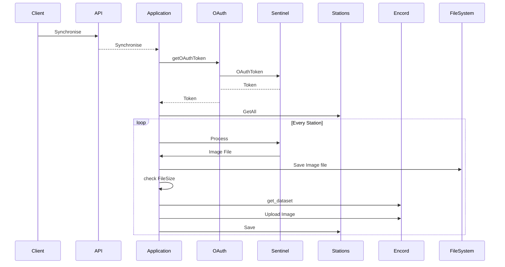

# Sentinel to Encord sync

```mermaid
sequenceDiagram

    participant cli as Client
    participant api as API
    participant app as Application
    participant oat as OAuth
    participant sen as Sentinel
    participant sta as Stations
    participant enc as Encord
    participant fs as FileSystem

    cli->>api: Synchronise
    api-->>app: Synchronise
    app->>oat: getOAuthToken
    oat->>sen: OAuthToken
    sen-->oat: Token
    oat-->>app: Token
    app->>sta: GetAll
    loop Every Station
      app->>sen: Process
      sen->>app: Image File
      app->>fs: Save Image file
      app->>app: check FileSize
      app->>enc: get_dataset
      app->>enc: Upload Image
      app->>sta: Save 
    end 
```
